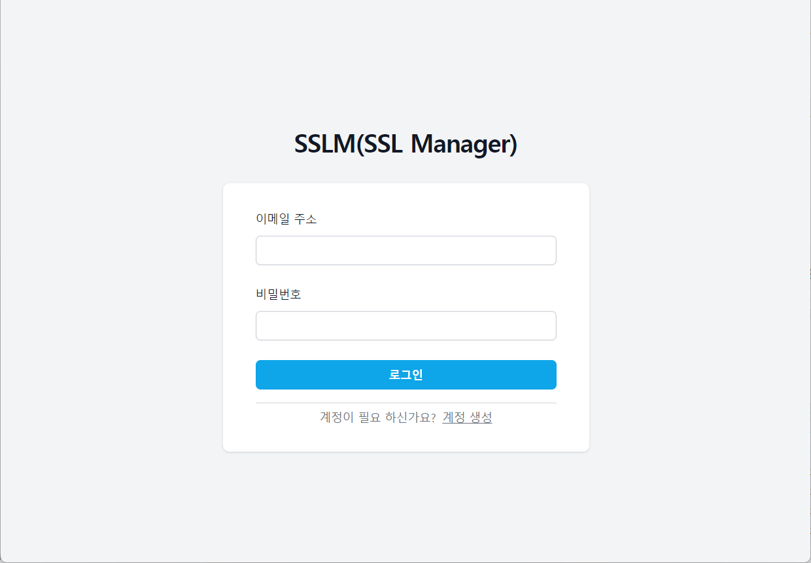
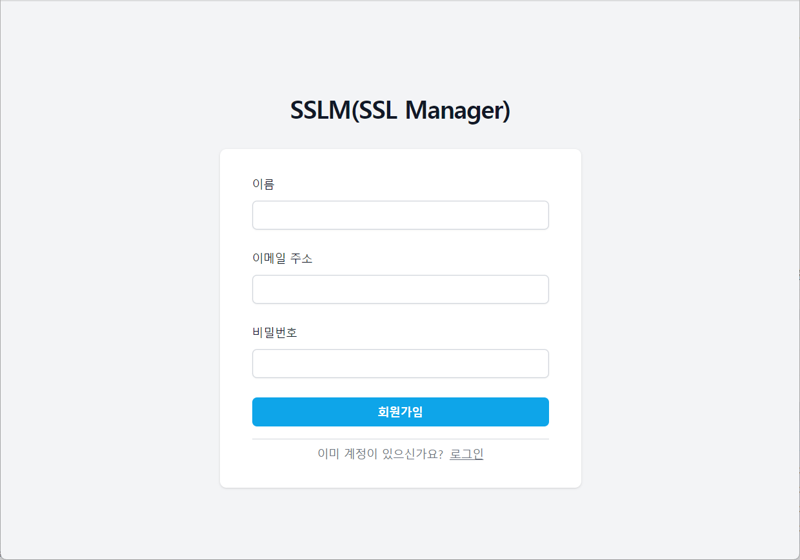
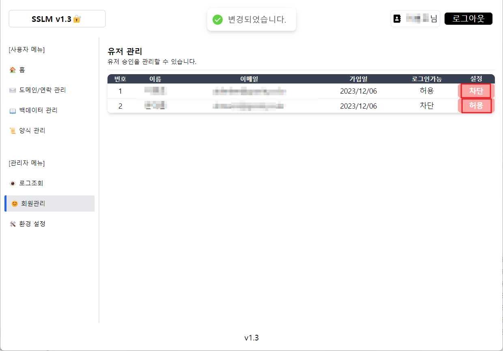
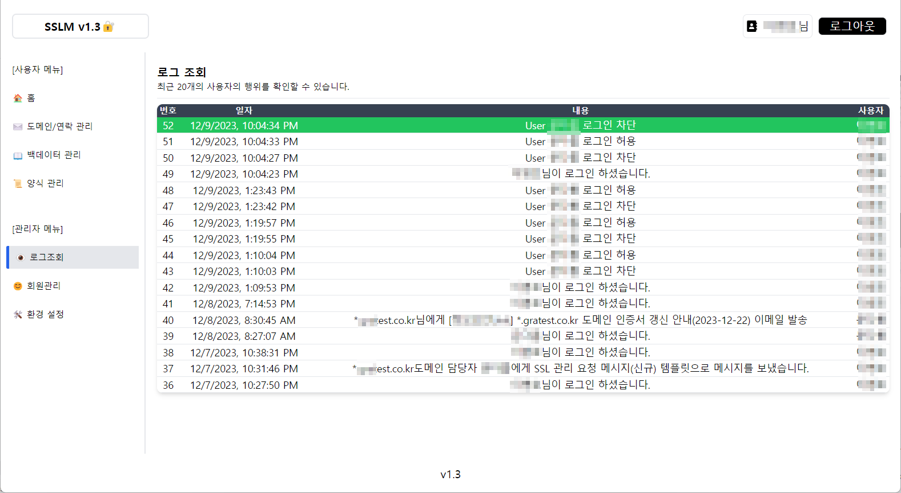

# SSLM
SSL 인증서 관리자 페이지
- 도메인을 등록 관리하며 담당자에게 정해진 양식으로 이메일 및 메시지를 전송할 수 있습니다.

# 설치
0. nodejs 설치
```angular2html
https://nodejs.org/en/download 에서 OS에 맞는 것을 설치한다.
```
1. 환경설정
```javascript
# .env

# main 페이지의 이미지
# public 폴더에 이미지 파일을 업로드하고 파일명을 입력합니다.
NEXT_PUBLIC_LOGO_FILE="welcome.svg"

# main 페이지의 comment를 입력합니다.
NEXT_PUBLIC_COMMENT1="너무 멋진 나의 모습"
NEXT_PUBLIC_COMMENT2="이럴수가 나의 솔루션!"
NEXT_PUBLIC_COMMENT3="감자탕을 먹고싶어요~"

# dooray 이메일 도메인을 입력합니다.
NEXT_PUBLIC_EMAIL_DOMAIN="test.com"

# 타이틀 및 푸터의 버전을 입력합니다.
NEXT_PUBLIC_VERSION="1.3"

# Next Auth
# 자신이 원하는 암호화키를 입력합니다
NEXTAUTH_SECRET="secret"
# Production 환경의 url을 입력합니다.
NEXTAUTH_URL="http://mysite.com"
# Development 환경의 url을 입력합니다.
NEXTAUTH_URL_INTERNAL="http://localhost:3000"
```

2. nextjs 모듈 설치
```javascript
npm i 
```

3. database 세팅
```javascript
npx prisma db push
```


# 실행 
A. 개발환경
1. 실행
```javascript
npm run dev
```

B. 운영환경
1. 빌드
```javascript
npm run build
```
2. 실행
```javascript
npm run start
```

# 설명

### 로그인 화면


### 회원가입 화면
- 최초 가입자는 Admin 권한을 가지며, 이후에는 Admin 권한을 가진 사용자가 신규 계정의 로그인 허용정책을 설정할 수 있습니다.

- 오른쪽의 설정에서 유저의 로그인 기능을 허용 차단 할 수 있습니다.

### 메인화면
- .env 파일 환경 변수가 반영되는 곳 입니다.
- 

### 도메인 관리
- A 도메인을 등록하여 관리할 수 있습니다.
- 
- B 도메인 등록 및 수정을 할 수 있습니다.
  - (담당자 및 이메일 조회는 Dooray 사용자 한정)
- 
- C 연락을 통하여 원하는 템플릿 기반으로 연락 할 수 있습니다.
  - (메시지는 Dooray 사용자 한정)
- 

### 템플릿 관리
- A 템플릿을 등록하여 관리할 수 있습니다.
- 
- B 템플릿을 등록 및 수정을 할 수 있습니다.
- 

### 결과 화면(이메일)
- A 이메일 연락 양식에 맞추어 이메일을 발신할 수 있습니다.
- 
- B 메시지 연락 양식에 맞추어 메시지를 발송할 수 있습니다.
- 

### 로그 조회
- 최근 일어난 행위에 대하여 확인할 수 있습니다.
