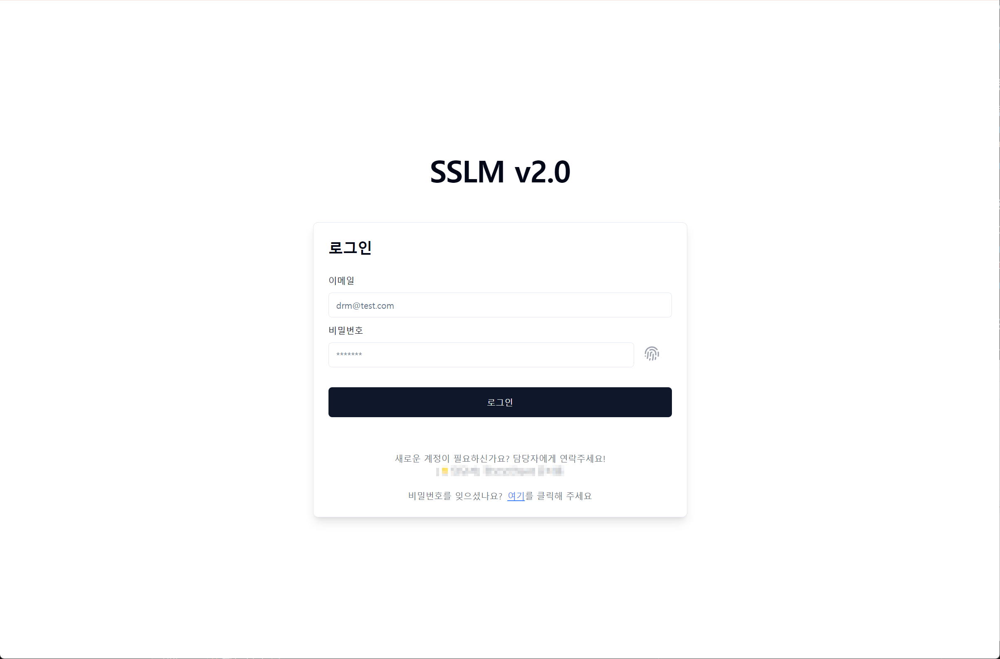
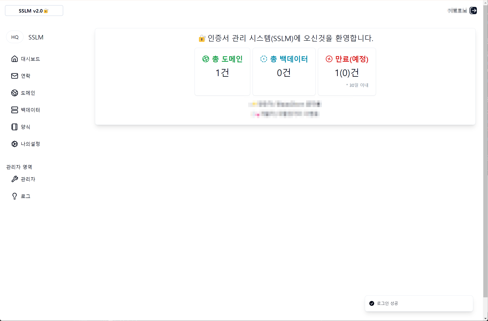

# SSLM

SSL 인증서 관리자 페이지

- 도메인을 등록 관리하며 담당자에게 정해진 양식으로 이메일 및 메시지를 전송할 수 있습니다.

# 설명

### 로그인 화면



### 메인화면



## 설치

<details><summary><b>상세 내용 펼쳐보기</b></summary>

1. Clone the repository:

   ```sh
   git clone https://github.com/TwoIceFIsh/sslm.git
   cd sslm
   ```

1. 의존성 설치

   ```sh
   npm install
   ```

1. 환경 변수 설정

   ```sh
   cp .env.example .env
   ```

1. 환경설정

    ```dotenv
    # .env.sample
    
    # npm run dev
    NEXT_PUBLIC_DEV_URL="http://localhost:3000"
    
    # npm run start
    NEXT_PUBLIC_PROD_URL="https://{EXTERNAL_URL}}"
    
    # logo path(basis path public folder)
    NEXT_PUBLIC_LOGO_FILE="/logo.jpg"
    
    # main comment
    NEXT_PUBLIC_COMMENT1="🔐인증서 관리 시스템(SSLM)에 오신것을 환영합니다."
    NEXT_PUBLIC_COMMENT2=""
    NEXT_PUBLIC_COMMENT3=""
    NEXT_PUBLIC_APP_NAME="SSLM"
    
    NEXT_PUBLIC_APP_URL="http://localhost:3000"
    NEXT_PUBLIC_VERSION="v2.0.0"
    
    # Next Auth
    AUTH_SECRET="secret"
    NEXT_PUBLIC_NEXTAUTH_URL="http://localhost:3000"
    AUTH_TRUST_HOST=true
    ```

1. 빌드

   ```sh
    npm run build
   ```

1. 실행

   ```sh
    npm run start
    ```